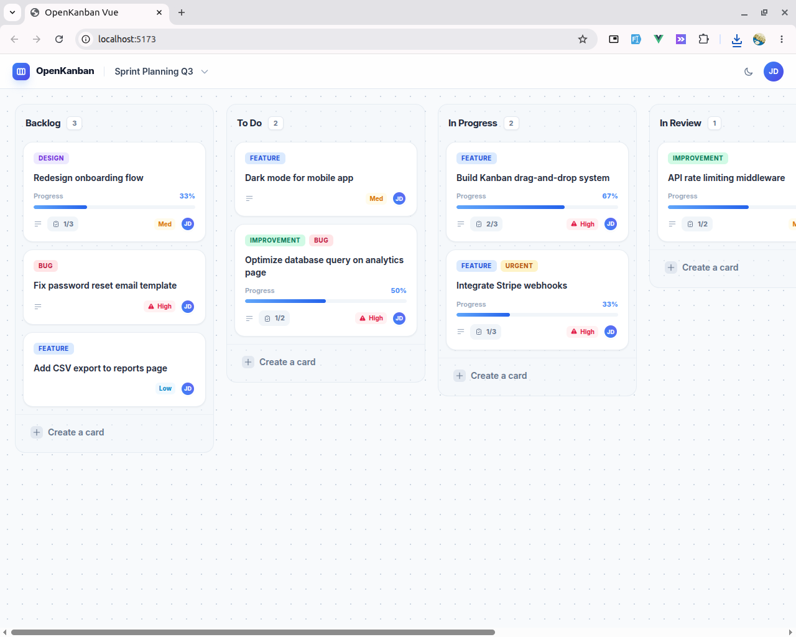
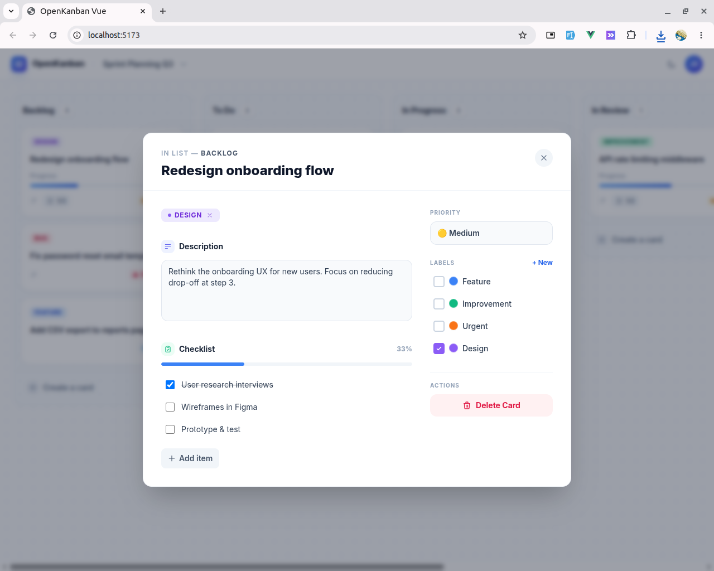
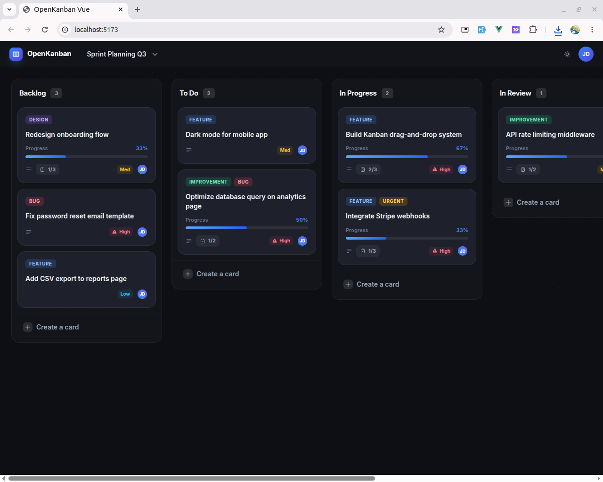

# OpenKanban Vue

> A fully interactive Trello-like Kanban board built with Vue 3, TypeScript, Pinia, and Tailwind CSS — no backend required.



## Features

- **Fully Interactive Drag & Drop**: Move cards between columns, reorder lists, and organize your work effortlessly using `vuedraggable`.
- **Local Persistence**: Data is persisted seamlessly in the browser using `localStorage` via `@vueuse/core`. Offline-first.
- **Rich Card Management**: 
  - Add descriptions, priorities, labels, and checklists.
  - Custom UI modal for detailed card editing.
- **Multiple Boards**: Create and switch between multiple boards.
- **Beautiful UI**: Modern SaaS-like design built with Tailwind CSS. Includes 🌙 Dark Mode and ☀️ Light Mode toggles.
- **Clean Architecture**: Built following best practices with Pinia store modules, Vue 3 Composition API, and strict TypeScript typing.

## Architecture Explanation

The application relies strictly on frontend technologies:
1. **State Management**: `Pinia` handles all reactive state updates. `useBoardStore` manages the boards, lists, and cards hierarchy.
2. **Persistence Layer**: `@vueuse/core` synchronizes the Pinia store with `localStorage` automatically, making it fully offline-capable.
3. **Drag and Drop Engine**: `vuedraggable` handles complex DOM interactions for list and card movements, bound directly to reactive arrays.
4. **Styling**: `Tailwind CSS` utility classes provide a fully responsive and themeable layout.

## Installation

Install the library via NPM:
```bash
npm install openkanban-vue
```

## Usage

Import the component and its stylesheet into your Vue 3 application. Because it uses Pinia for state management, make sure Pinia is installed and activated.

```vue
<script setup>
import { KanbanBoard } from 'openkanban-vue'
import 'openkanban-vue/style.css'
</script>

<template>
  <!-- Render the board in a full-height container -->
  <div style="height: 100vh;">
    <KanbanBoard />
  </div>
</template>
```

### Developing Locally

If you want to clone this repository and modify it:

1. Install dependencies:
   ```bash
   npm install
   ```

2. Start the development server:
   ```bash
   npm run dev
   ```

3. Build for production:
   ```bash
   npm run build
   ```

## Project Structure

```text
src/
├── components/
│   ├── KanbanList.vue   # Handles individual lists/columns
│   ├── KanbanCard.vue   # Individual card rendering
│   └── CardModal.vue    # Detailed editing interface
├── stores/
│   └── boardStore.ts    # Centralized Pinia state & persistence
├── types/
│   └── labelColors.ts   # Shared tailwind color mapping utilities
└── views/
    └── BoardView.vue    # Main application layout
```

## Contributing

Contributions, issues, and feature requests are welcome! Feel free to check the issues page.

1. Fork the Project
2. Create your Feature Branch (`git checkout -b feature/AmazingFeature`)
3. Commit your Changes (`git commit -m 'Add some AmazingFeature'`)
5. Open a Pull Request

## Credits

Developed and maintained by **[Kamran Haider](https://github.com/haider-kamran)**. 

## License

This project is [MIT licensed](LICENSE).

## 🛠 Tech Stack

- **Vue 3** (Composition API)
- **TypeScript**
- **Vite**
- **Pinia** (State)
- **Tailwind CSS** (Styling)
- **VueUse** (Composables & LocalStorage)
- **VueDraggable** (Drag & Drop engine)
